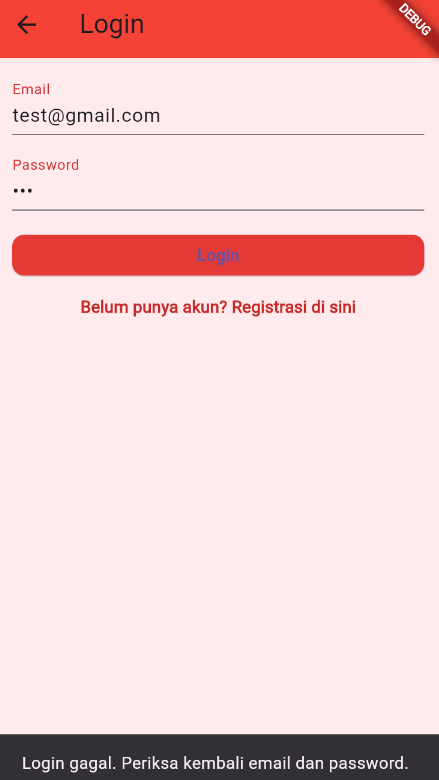
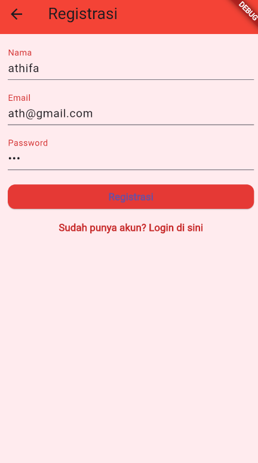
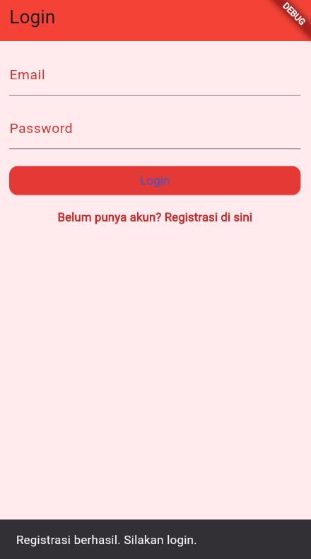
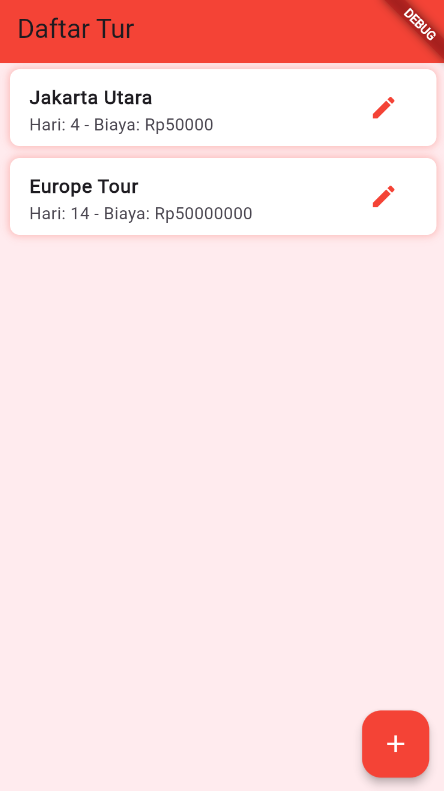
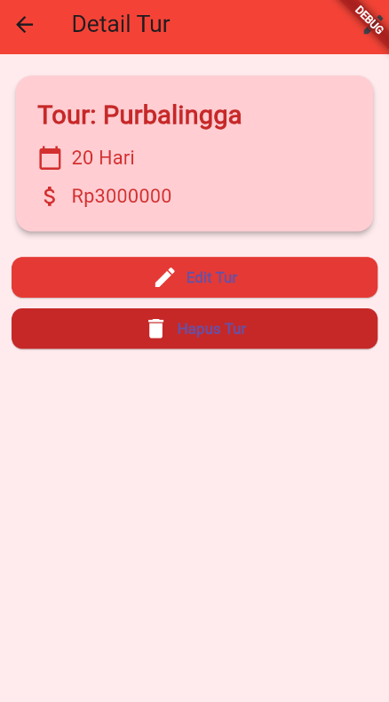
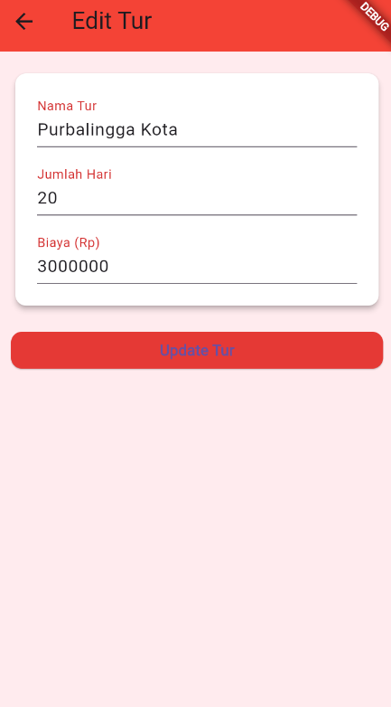
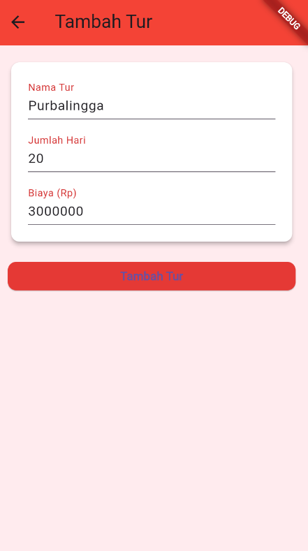
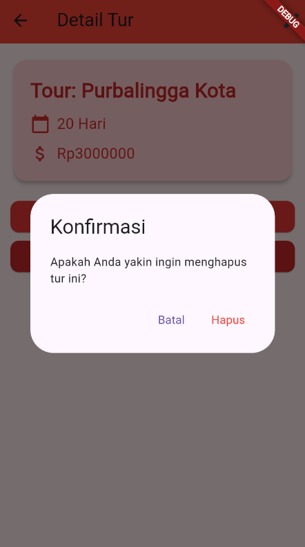

# Manajemen Pariwisata

**Nama**       : Athifa Nathania  
**NIM**        : H1D022031  
**Shift Baru** : F
**Shift Lama** : D

## RESPONSI 1 PRAKTIKUM PEMROGRAMAN MOBILE
## Screenshot Aplikasi Manajemen Pariwisata

#### a. Halaman Login
**Berhasil**

**Gagal**

#### b. Halaman Registrasi

#### c. Halaman List Tur

#### d. Halaman Detail Tur

#### e. Halaman Edit Tur
**Sukses**

**Gagal**

#### f. Halaman Tambah Tur
**Sukses**

**Gagal**

#### g. Hapus Tur

